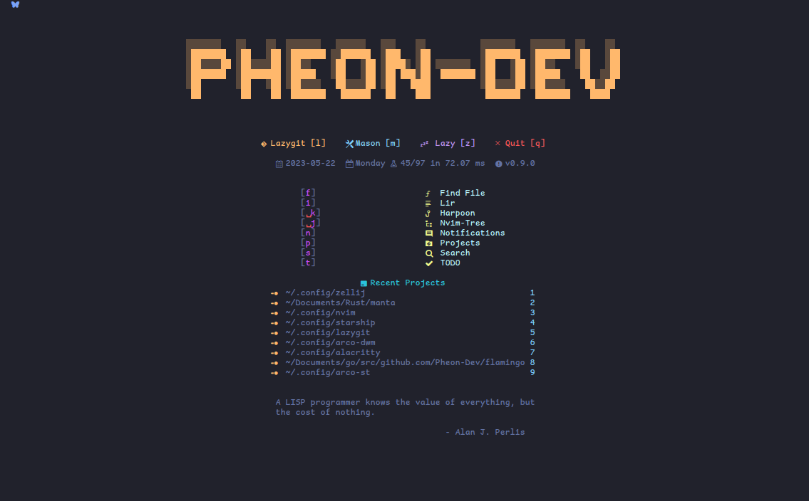
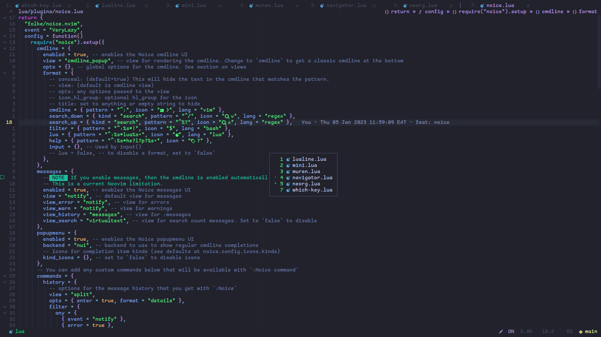
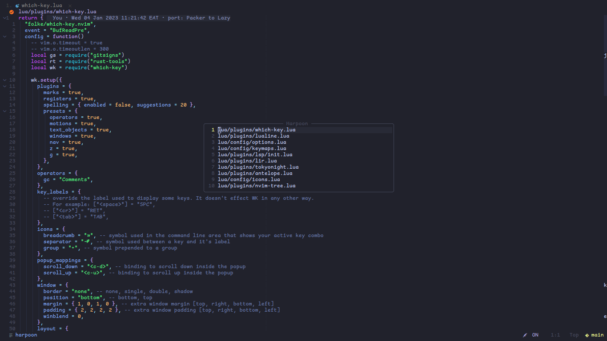
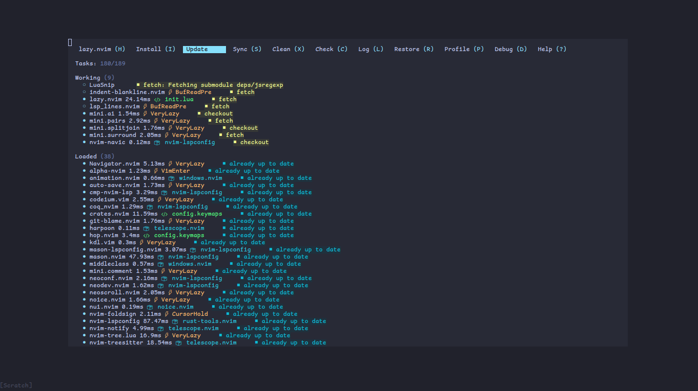
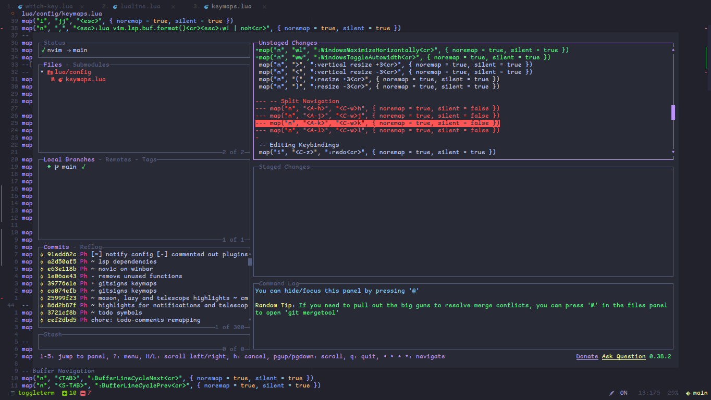
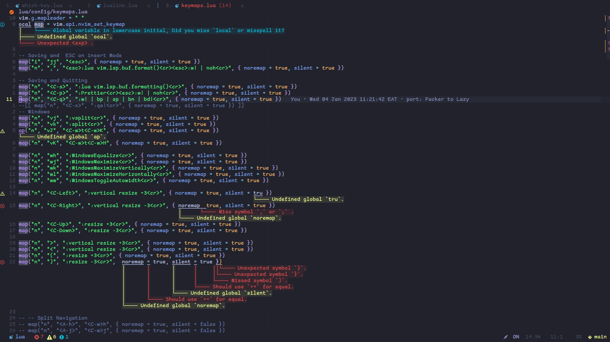
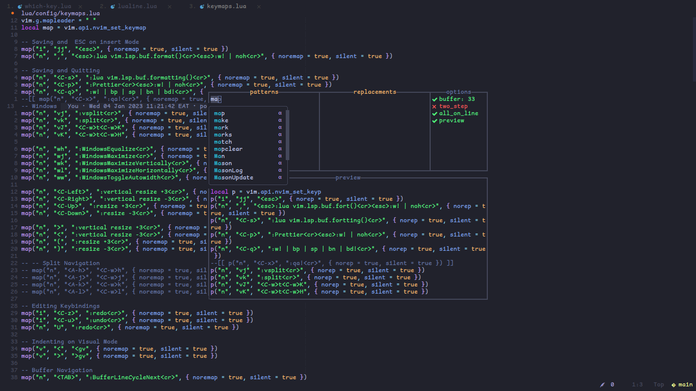
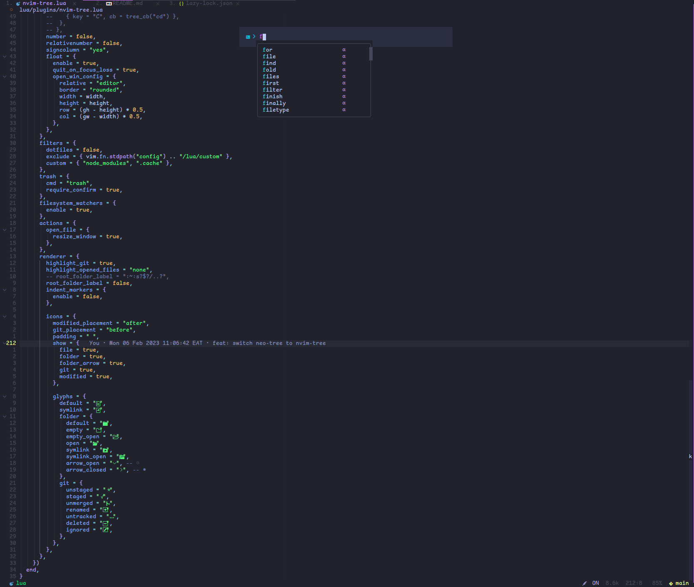
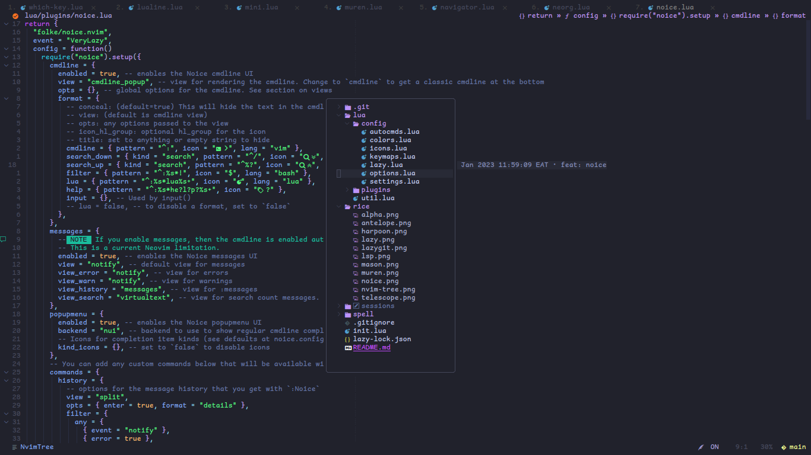
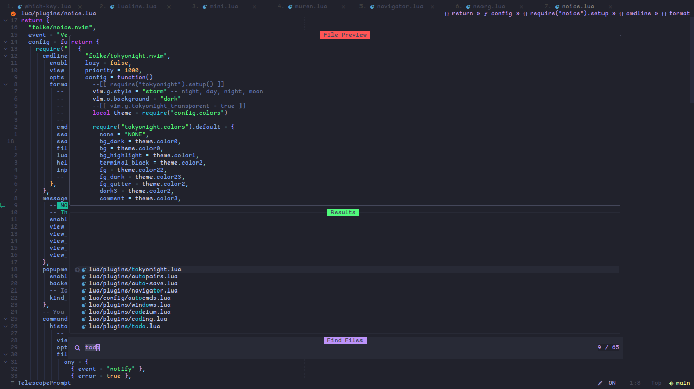

# PHEON-DEV

    ------------------------

*   [folke/tokyonight.nvim](https://github.com/folke/tokyonight.nvim)

*   [goolord/alpha-nvim](https://github.com/goolord/alpha-nvim)
    

    ***

*   [Pheon-Dev/antelope](https://github.com/Pheon-Dev/antelope)
    

    ***

*   [Pheon-Dev/antelope](https://github.com/Pheon-Dev/antelope)
    

    ***

*   [folke/lazy.nvim](https://github.com/folke/lazy.nvim)
    

    ***

*   [Lazygit](https://github.com/jesseduffield/lazygit)

*   [akinsho/toggleterm.nvim](https://github.com/akinsho/toggleterm.nvim)
    

    ***

*   [Pheon-Dev/lsp\_lines.nvim](https://github.com/Pheon-Dev/lsp_lines.nvim)
    

    ***

*   [williamboman/mason.nvim](https://github.com/williamboman/mason.nvim)
    

    ***

*   [AckslD/muren.nvim](https://github.com/AckslD/muren.nvim)
    

    ***

*   [folke/noice.nvim](https://github.com/folke/noice.nvim)
    

    ***

*   [kyazdani42/nvim-tree.lua](https://github.com/kyazdani42/nvim-tree.lua)

*   [nvim-tree/nvim-tree.lua](https://github.com/nvim-tree/nvim-tree.lua)
    

    ***

*   [nvim-telescope/telescope.nvim](https://github.com/nvim-telescope/telescope.nvim)
    
