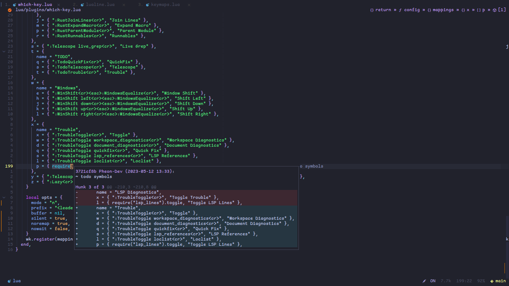

# PHEON-DEV

## Plugins

*   [LuaSnip](https://github.com/LuaSnip)
*   [Navigator.nvim](https://github.com/Navigator.nvim)
*   [alpha-nvim](https://github.com/alpha-nvim)
*   [animation.nvim](https://github.com/animation.nvim)
*   [antelope](https://github.com/antelope)
*   [auto-save.nvim](https://github.com/auto-save.nvim)
*   [cmp-buffer](https://github.com/cmp-buffer)
*   [cmp-cmdline](https://github.com/cmp-cmdline)
*   [cmp-emoji](https://github.com/cmp-emoji)
*   [cmp-nvim-lsp](https://github.com/cmp-nvim-lsp)
*   [cmp-nvim-lua](https://github.com/cmp-nvim-lua)
*   [cmp-path](https://github.com/cmp-path)
*   [cmp-tabnine](https://github.com/cmp-tabnine)
*   [cmp-under-comparator](https://github.com/cmp-under-comparator)
*   [cmp\_luasnip](https://github.com/cmp_luasnip)
*   [codeium.vim](https://github.com/codeium.vim)
*   [coq\_nvim](https://github.com/coq_nvim)
*   [crates.nvim](https://github.com/crates.nvim)
*   [dial.nvim](https://github.com/dial.nvim)
*   [dressing.nvim](https://github.com/dressing.nvim)
*   [filetype.nvim](https://github.com/filetype.nvim)
*   [friendly-snippets](https://github.com/friendly-snippets)
*   [git-blame.nvim](https://github.com/git-blame.nvim)
*   [gitsigns.nvim](https://github.com/gitsigns.nvim)
*   [go.nvim](https://github.com/go.nvim)
*   [gocode](https://github.com/gocode)
*   [gopher.nvim](https://github.com/gopher.nvim)
*   [guihua.lua](https://github.com/guihua.lua)
*   [harpoon](https://github.com/harpoon)
*   [hop.nvim](https://github.com/hop.nvim)
*   [impatient.nvim](https://github.com/impatient.nvim)
*   [indent-blankline.nvim](https://github.com/indent-blankline.nvim)
*   [kdl.vim](https://github.com/kdl.vim)
*   [lazy.nvim](https://github.com/lazy.nvim)
*   [lir.nvim](https://github.com/lir.nvim)
*   [lsp-colors.nvim](https://github.com/lsp-colors.nvim)
*   [lsp-inlayhints.nvim](https://github.com/lsp-inlayhints.nvim)
*   [lsp\_lines.nvim](https://github.com/lsp_lines.nvim)
*   [lspkind-nvim](https://github.com/lspkind-nvim)
*   [lspsaga.nvim](https://github.com/lspsaga.nvim)
*   [lualine.nvim](https://github.com/lualine.nvim)
*   [mason-lspconfig.nvim](https://github.com/mason-lspconfig.nvim)
*   [mason.nvim](https://github.com/mason.nvim)
*   [middleclass](https://github.com/middleclass)
*   [mini.ai](https://github.com/mini.ai)
*   [mini.comment](https://github.com/mini.comment)
*   [mini.indentscope](https://github.com/mini.indentscope)
*   [mini.pairs](https://github.com/mini.pairs)
*   [mini.splitjoin](https://github.com/mini.splitjoin)
*   [mini.surround](https://github.com/mini.surround)
*   [muren.nvim](https://github.com/muren.nvim)
*   [neoconf.nvim](https://github.com/neoconf.nvim)
*   [neodev.nvim](https://github.com/neodev.nvim)
*   [neorg](https://github.com/neorg)
*   [neoscroll.nvim](https://github.com/neoscroll.nvim)
*   [noice.nvim](https://github.com/noice.nvim)
*   [nui.nvim](https://github.com/nui.nvim)
*   [null-ls.nvim](https://github.com/null-ls.nvim)
*   [nvim-autopairs](https://github.com/nvim-autopairs)
*   [nvim-bufferline.lua](https://github.com/nvim-bufferline.lua)
*   [nvim-cmp](https://github.com/nvim-cmp)
*   [nvim-colorizer.lua](https://github.com/nvim-colorizer.lua)
*   [nvim-foldsign](https://github.com/nvim-foldsign)
*   [nvim-gomove](https://github.com/nvim-gomove)
*   [nvim-hlslens](https://github.com/nvim-hlslens)
*   [nvim-lspconfig](https://github.com/nvim-lspconfig)
*   [nvim-navic](https://github.com/nvim-navic)
*   [nvim-notify](https://github.com/nvim-notify)
*   [nvim-tree.lua](https://github.com/nvim-tree.lua)
*   [nvim-treesitter](https://github.com/nvim-treesitter)
*   [nvim-ts-autotag](https://github.com/nvim-ts-autotag)
*   [nvim-ts-context-commentstring](https://github.com/nvim-ts-context-commentstring)
*   [nvim-ts-rainbow](https://github.com/nvim-ts-rainbow)
*   [nvim-ufo](https://github.com/nvim-ufo)
*   [nvim-web-devicons](https://github.com/nvim-web-devicons)
*   [persistence.nvim](https://github.com/persistence.nvim)
*   [plenary.nvim](https://github.com/plenary.nvim)
*   [popup.nvim](https://github.com/popup.nvim)
*   [promise-async](https://github.com/promise-async)
*   [rainbow\_parentheses.vim](https://github.com/rainbow_parentheses.vim)
*   [rust-tools.nvim](https://github.com/rust-tools.nvim)
*   [satellite.nvim](https://github.com/satellite.nvim)
*   [sentiment.nvim](https://github.com/sentiment.nvim)
*   [structrue-go.nvim](https://github.com/structrue-go.nvim)
*   [stylua-nvim](https://github.com/stylua-nvim)
*   [telescope.nvim](https://github.com/telescope.nvim)
*   [todo-comments.nvim](https://github.com/todo-comments.nvim)
*   [toggleterm.nvim](https://github.com/toggleterm.nvim)
*   [tokyonight.nvim](https://github.com/tokyonight.nvim)
*   [trouble.nvim](https://github.com/trouble.nvim)
*   [vim-illuminate](https://github.com/vim-illuminate)
*   [vim-startuptime](https://github.com/vim-startuptime)
*   [virtcolumn.nvim](https://github.com/virtcolumn.nvim)
*   [which-key.nvim](https://github.com/which-key.nvim)
*   [windows.nvim](https://github.com/windows.nvim)
*   [winshift.nvim](https://github.com/winshift.nvim)
*   [yanky.nvim](https://github.com/yanky.nvim)

<!---->

*   [folke/tokyonight.nvim](https://github.com/folke/tokyonight.nvim)

*   [goolord/alpha-nvim](https://github.com/goolord/alpha-nvim)
    

    ***

*   [Pheon-Dev/antelope](https://github.com/Pheon-Dev/antelope)
    

    ***

*   [Pheon-Dev/harpoon](https://github.com/Pheon-Dev/harpoon)
    

    ***

*   [folke/lazy.nvim](https://github.com/folke/lazy.nvim)
    

    ***

*   [lewis6991/gitsigns.nvim](https://github.com/lewis6991/gitsigns.nvim)
    

    ***

*   [Lazygit](https://github.com/jesseduffield/lazygit)

*   [akinsho/toggleterm.nvim](https://github.com/akinsho/toggleterm.nvim)
    

    ***

*   [Pheon-Dev/lsp\_lines.nvim](https://github.com/Pheon-Dev/lsp_lines.nvim)
    

    ***

*   [williamboman/mason.nvim](https://github.com/williamboman/mason.nvim)
    

    ***

*   [AckslD/muren.nvim](https://github.com/AckslD/muren.nvim)
    

    ***

*   [folke/noice.nvim](https://github.com/folke/noice.nvim)
    

    ***

*   [kyazdani42/nvim-tree.lua](https://github.com/kyazdani42/nvim-tree.lua)

*   [nvim-tree/nvim-tree.lua](https://github.com/nvim-tree/nvim-tree.lua)
    

    ***

*   [nvim-telescope/telescope.nvim](https://github.com/nvim-telescope/telescope.nvim)
    
